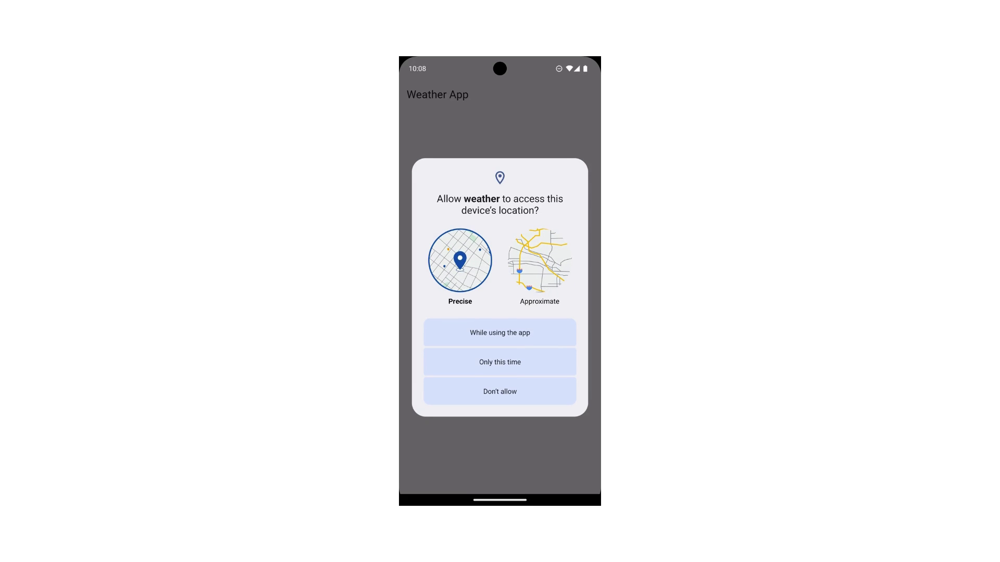
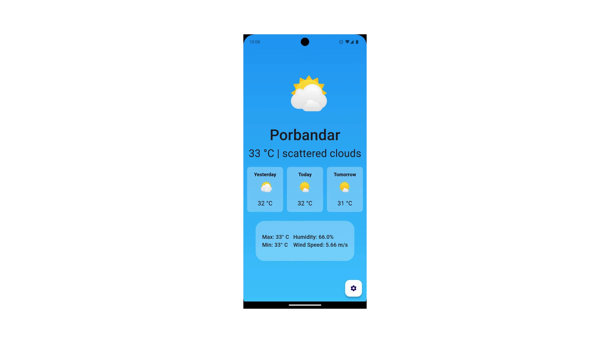
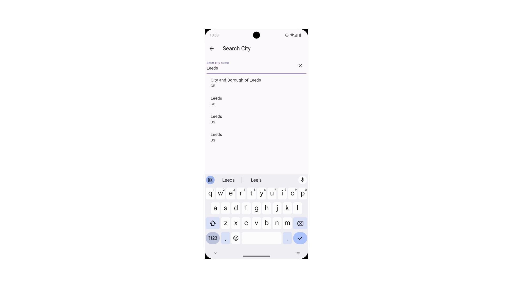
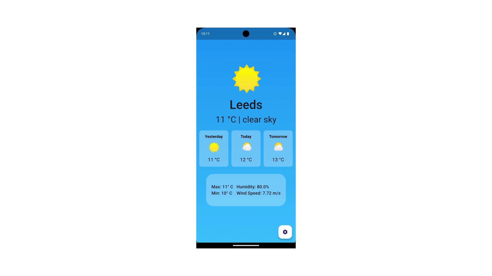

🌦️ Weather App

A simple and elegant Weather App built with Flutter, Firebase, and the OpenWeatherMap API.
This app provides real-time weather updates for any location with a clean and user-friendly interface.

📱 Screenshots

   

✨ Key Highlights

🌍 Search weather by city

⛅ Real-time data from OpenWeatherMap API

📊 Displays temperature, humidity, and wind speed

🔥 Firebase integration

📱 Cross-platform app (Android & iOS) built with Flutter

🚀 About This Repository

This repository is intended only for showcasing the app with screenshots and demo.
The source code is not publicly shared.

📬 Contact

If you’re interested in this project or would like to collaborate, feel free to reach out!
